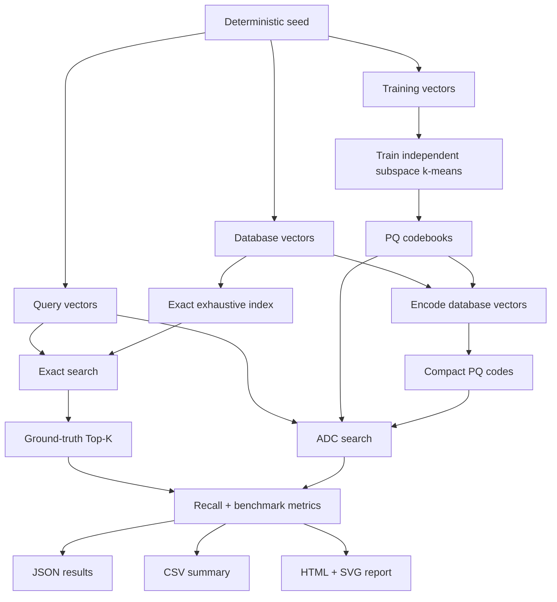
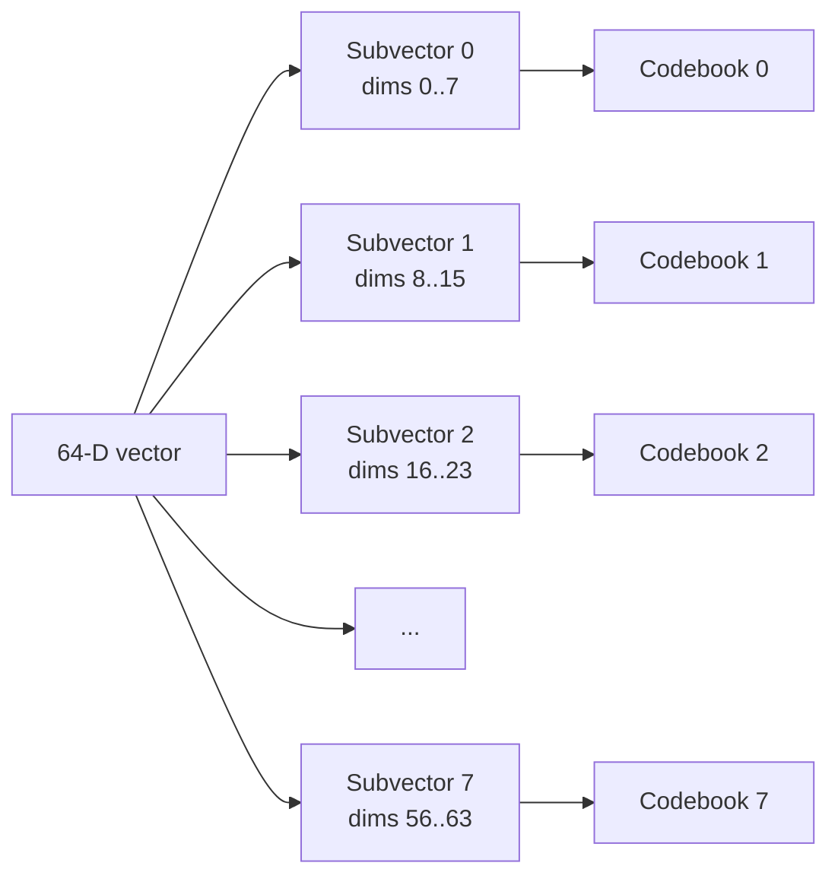
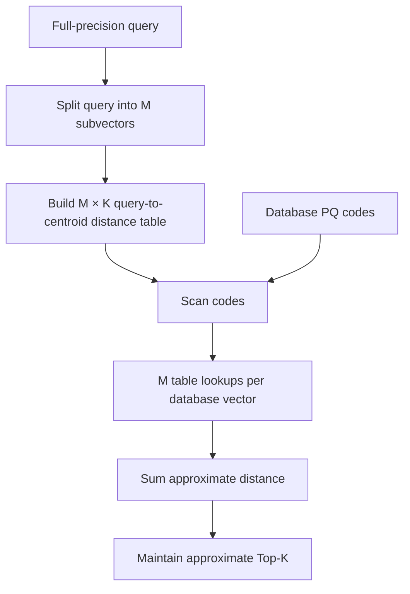

# product-quantization-vector-search

**Product Quantization (PQ)** and **Asymmetric Distance Computation (ADC)**.

The project deliberately avoids FAISS, HNSW, IVF, GPUs, external embeddings, and external ANN libraries. Its purpose is to make the mechanics and trade-offs of Product Quantization visible and measurable.

## Core question

> How aggressively can a dense vector be compressed into centroid IDs before nearest-neighbor recall degrades too far?

The repository compares:

- exact exhaustive Euclidean nearest-neighbor search over full `f32` vectors;
- Product Quantization with independently trained k-means codebooks per subspace;
- ADC search over compressed PQ codes without reconstructing database vectors.

The benchmark reports:

- `Recall@1`, `Recall@5`, and headline `Recall@10`;
- raw vector bytes per vector;
- actual PQ code bytes per vector;
- theoretical packed code bits per vector;
- amortized codebook bytes per vector;
- compression ratio;
- quantization mean squared error;
- exact coordinate-distance operations;
- ADC query-to-centroid coordinate operations;
- ADC code lookups/additions;
- wall-clock search time;
- PQ training time;
- encoding time.

A self-contained HTML report and SVG charts visualize recall versus compression and the memory/accuracy trade-off.

---

## MVP constraints

The initial implementation MUST remain sharply limited.

### Included

- Rust stable.
- Deterministic synthetic datasets.
- Vector dimensions: 32 or 64.
- Exact squared-Euclidean search.
- Product Quantization.
- 4 or 8 subspaces.
- Independent deterministic k-means training for each subspace.
- Codebook sizes: 16, 64, or 256 centroids.
- One-byte centroid IDs in the actual MVP index.
- ADC search using precomputed query-to-centroid distance tables.
- Top-k search.
- Recall measurement against exact search.
- Memory accounting.
- Quantization error.
- Deterministic benchmark matrix.
- JSON and CSV benchmark artifacts.
- Self-contained HTML report.
- SVG charts.
- Unit and integration tests.

### Explicitly excluded

Do NOT implement these in the MVP:

- FAISS;
- HNSW;
- IVF or IVF-PQ;
- OPQ;
- residual quantization;
- scalar quantization;
- GPU code;
- SIMD-specific optimization;
- external embedding APIs;
- external vector datasets;
- cosine similarity;
- disk-backed indexes;
- persistence formats intended for production use;
- multithreaded k-means;
- distributed search;
- incremental training.

These may be discussed under `Future Work`, but must not affect MVP implementation.

---

## Default benchmark

The default reproducible benchmark uses:

```text
dimension             = 64
training_vectors       = 10_000
database_vectors       = 50_000
query_vectors          = 200
latent_clusters        = 32
seed                   = 42
top_k                  = 10
dataset                 = clustered
subspaces              = [4, 8]
centroids_per_subspace = [16, 64, 256]
```

The implementation must also support a smaller fast configuration for tests and local experimentation.

---

## High-level architecture



---

## Product Quantization

For a vector dimension `D` and `M` subspaces:

```text
subvector_dimension = D / M
```

The MVP must reject configurations where:

```text
D % M != 0
```

Each subspace gets an independently trained k-means codebook.

For example, with `D = 64` and `M = 8`, each vector is split into eight 8-dimensional subvectors.



A database vector is stored as one centroid ID per subspace.

For `M = 8`, the MVP physical code is eight bytes because each centroid ID is stored as `u8`.

---

## Asymmetric Distance Computation

The query remains full precision. Database vectors remain compressed.

For query subvector `q_m` and centroid `c_(m,k)`:

```text
T[m][k] = squared_l2(q_m, c_(m,k))
```

The approximate distance to a PQ code is:

```text
ADC(q, code) =
    T[0][code[0]]
  + T[1][code[1]]
  + ...
  + T[M-1][code[M-1]]
```

The search path MUST NOT reconstruct database vectors.



---

## Repository layout

- `Cargo.toml` and `Cargo.lock` define the Rust package and pinned dependencies.
- `src/` contains the CLI, deterministic algorithms, benchmark runner, metrics, and report renderer.
- `docs/` contains the retained architecture and algorithm documentation.
- `artifacts/` contains locally generated output and tracks only its ignore controls.

---

## Expected commands

```bash
cargo run --release -- benchmark
```

Runs the default benchmark matrix and writes artifacts.

```bash
cargo run --release -- run \
  --dimension 64 \
  --training-vectors 10000 \
  --database-vectors 50000 \
  --query-vectors 200 \
  --subspaces 8 \
  --centroids 256 \
  --top-k 10 \
  --seed 42 \
  --dataset clustered
```

Runs one PQ configuration.

```bash
cargo run --release -- inspect-query \
  --experiment artifacts/results.json \
  --query 7
```

Displays a human-readable comparison of exact and PQ Top-K for one query.

```bash
cargo test
```

Runs deterministic unit and integration tests.

---

## Output artifacts

A benchmark run should produce:

```text
artifacts/
├── results.json
├── summary.csv
├── report.html
├── recall-vs-compression.svg
├── recall-vs-quantization-error.svg
├── search-time-vs-compression.svg
└── memory-vs-recall.svg
```

The HTML report must be self-contained: no CDN, JavaScript framework, remote stylesheet, remote font, or remote image.

---

## Interpreting memory and search scope

This MVP demonstrates PQ compression and approximate distance, not a complete ANN index: ADC still scans every database code and performs no IVF/HNSW-style pruning. The raw compression ratio compares a full vector with its physical byte-per-subspace code. The amortized ratio also distributes the shared codebook bytes across all database vectors, so it is the more complete memory comparison for a finite database.

---
## Definition of Done

The MVP is complete only when all of the following are true:

- exact exhaustive search returns deterministic Top-K;
- PQ codebooks are trained independently per subspace;
- k-means is deterministic for a given seed and input;
- database vectors encode into one centroid ID per subspace;
- ADC search never reconstructs vectors;
- ADC table distances are mathematically consistent with reconstructed-centroid distances within floating-point tolerance;
- exact and approximate Top-K results are compared with Recall@10;
- memory accounting distinguishes raw vectors, actual PQ code bytes, theoretical packed bits, codebooks, and amortized bytes;
- quantization MSE is reported;
- operation counters separate coordinate-distance operations from ADC lookup/add operations;
- default benchmark executes all `M × K` combinations;
- results are written to JSON and CSV;
- HTML and SVG reports are generated;
- same seed and configuration produce identical algorithmic outputs;
- `cargo fmt --check` passes;
- `cargo clippy --all-targets --all-features -- -D warnings` passes;
- `cargo test` passes;
- release benchmark completes without panics.

See `docs/architecture.md` and `docs/algorithms.md` for the retained technical documentation.
