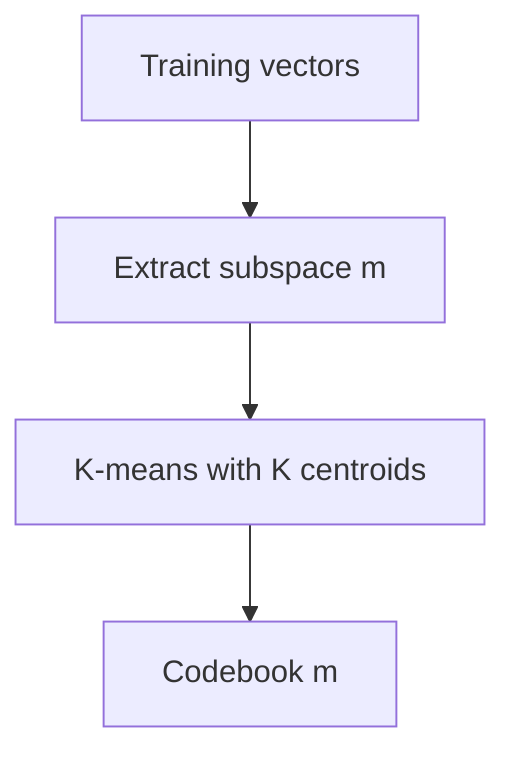

# Algorithms

## 1. Squared Euclidean distance

For equal-length vectors:

```text
distance = Σ (a[i] - b[i])²
```

Use explicit loops.

Do not call `sqrt`.

This distance preserves nearest-neighbor ordering relative to Euclidean distance.

---

## 2. Deterministic Top-K

Every candidate is:

```text
(distance, vector_id)
```

Ordering:

```text
A is better than B when:
- A.distance < B.distance, or
- distances are equal and A.vector_id < B.vector_id.
```

A bounded binary heap is appropriate.

Because Rust `f32` does not implement total mathematical ordering over NaN, generated/algorithmic distance values must be finite. Reject or debug-assert non-finite values before heap comparison.

It is acceptable to implement a small wrapper that uses `f32::total_cmp`.

Final output must be sorted ascending by the same ordering.

---

## 3. K-means++

Given points `x_0 ... x_(n-1)`:

### First centroid

Choose one input index through seeded RNG.

### Additional centroid

For every point, calculate:

```text
D(x) = squared distance to nearest selected centroid
```

Let:

```text
W = Σ D(x)
```

Draw deterministic random `r` in `[0, W)`.

Walk points in ascending input order, accumulating `D(x)`. Select the first point whose cumulative weight exceeds `r`.

### Zero-weight fallback

If:

```text
W == 0
```

select the lowest-index point not already selected.

If every input index is already selected—which should only occur when `K > n`, already rejected—configuration is invalid.

Value duplication is acceptable even when selected indices differ.

---

## 4. Lloyd iteration

Each iteration:


### Assignment

For each training point:

1. evaluate squared distance to every centroid;
2. choose minimum;
3. tie-break by lower centroid index.

### Empty cluster repair

After assignment and before final centroid recomputation:

1. enumerate empty cluster IDs ascending;
2. find the assigned point whose current assignment distance is largest;
3. tie-break by lower point index;
4. move that point from its old cluster to the empty cluster;
5. set empty cluster provisional centroid to the point;
6. update counts and assignment distance for moved point to zero;
7. continue.

A donor cluster must not be reduced below one point if another valid donor point exists. Therefore choose among points whose source cluster count is greater than one.

If no such point exists, the dataset cannot provide non-empty `K` clusters and training should fail with an explicit error. In valid `n >= K` input, this situation should be uncommon but duplicates can make it possible depending on assignments.

### Recompute

Accumulate coordinates for each cluster and divide by count.

Prefer `f64` accumulators:

```text
sum[c][d] += point[d] as f64
centroid[d] = (sum[c][d] / count[c]) as f32
```

### Convergence

Calculate squared shift for each centroid:

```text
shift[c] = squared_l2(old[c], new[c])
```

Stop when:

```text
max(shift) <= epsilon²
```

or maximum iterations reached.

Maximum-iteration completion is not an error; return the final model and record the iteration count.

---

## 5. Product Quantization split

For:

```text
D = vector dimension
M = subspaces
S = D / M
```

subspace `m` maps to:

```text
start = m × S
end   = start + S
```

No dimension reordering is performed in the MVP.

Example:

```text
D=32, M=4, S=8

m=0 => [0, 8)
m=1 => [8, 16)
m=2 => [16, 24)
m=3 => [24, 32)
```

---

## 6. PQ training

For every subspace independently:



The result is `M` codebooks.

Each codebook contains `K` centroids of dimensionality `S`.

Total centroid coordinates:

```text
M × K × S
= M × K × (D / M)
= K × D
```

This proves shared codebook float memory is independent of `M` when `D` and `K` are fixed.

---

## 7. PQ encoding

For database vector `x`:

For each subspace `m`:

```text
code[m] =
    argmin_k squared_l2(x_m, centroid[m][k])
```

Tie-break lower centroid ID.

Physical storage is one byte per subspace.

---

## 8. Reconstruction

For a PQ code:

```text
x_hat =
    concatenate(
        centroid[0][code[0]],
        centroid[1][code[1]],
        ...,
        centroid[M-1][code[M-1]]
    )
```

Reconstruction is useful for:

- visualization;
- quantization-error calculation;
- ADC invariant tests.

It is prohibited in the ADC query loop.

---

## 9. ADC table

For query `q`:

```text
T[m][k] =
    squared_l2(q_m, centroid[m][k])
```

Table has:

```text
M × K
```

entries.

Coordinate operations:

```text
M × K × S
= K × D
```

per query.

---

## 10. ADC distance

For code `c`:

```text
adc(q,c) =
    Σ_m T[m][c[m]]
```

No database-vector coordinates are touched.

Per database vector:

```text
M table lookups
M additions
```

---

## 11. ADC equivalence

Because reconstruction concatenates selected centroids and Euclidean squared distance decomposes additively across coordinate partitions:

```text
squared_l2(q, reconstruct(c))
=
Σ_m squared_l2(q_m, centroid[m][c[m]])
=
adc(q,c)
```

This identity is the most important mathematical correctness invariant in the project.

---

## 12. Recall@K

Inputs:

- exact Top-K IDs;
- approximate Top-K IDs.

Calculate:

```text
hits = number of IDs present in both lists
recall = hits / K
```

The lists are expected to contain unique database IDs.

Use a simple small-set method. Since `K <= 10` by default, an O(K²) implementation is perfectly acceptable and may be clearer than allocating a hash set.

---

## 13. Quantization error

For database vector `x` and code `c`:

```text
error(x) =
    squared_l2(x, reconstruct(c))
```

Metric:

```text
mean_squared_reconstruction_error_per_vector =
    Σ error(x) / N
```

This is total squared reconstruction error averaged per vector, not divided by vector dimension.

---

## 14. Theoretical code width

For centroid count `K`:

```text
bits_per_code = ceil(log2(K))
```

For supported values:

```text
K=16  => 4 bits
K=64  => 6 bits
K=256 => 8 bits
```

Theoretical packed bits:

```text
M × bits_per_code
```

The physical MVP still stores `M` bytes.

Do not implement bit packing.
