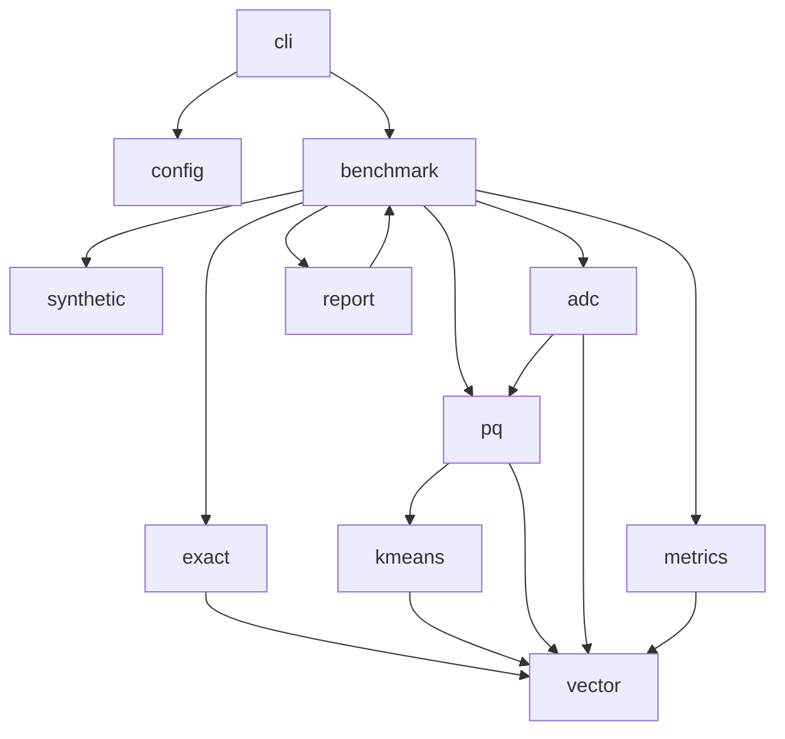
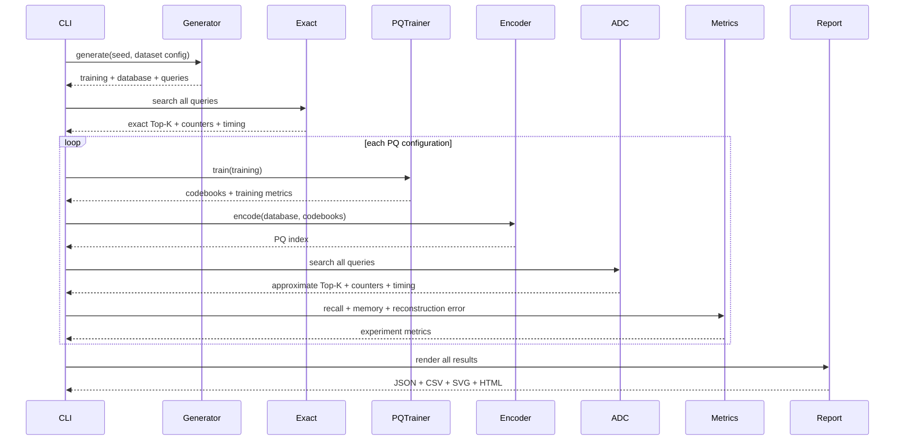
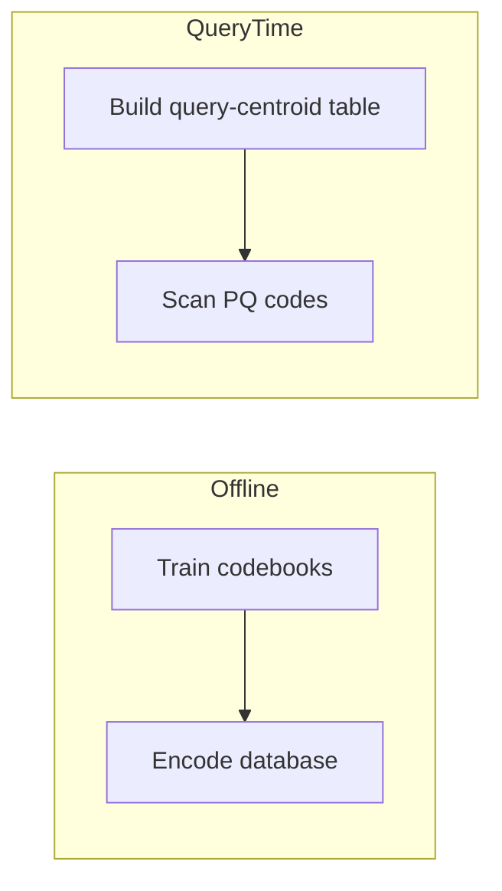

# Architecture

## Architectural objective

Keep the algorithmic layers separate enough that the user can understand which costs come from:

- exact distance computation;
- codebook training;
- quantization;
- ADC table construction;
- ADC scanning;
- metric/report generation.

Avoid a single monolithic benchmark function.

---

## Module responsibilities



---

## Dependency direction

Low-level modules must not depend on report or CLI layers.

Preferred dependency direction:

```text
vector
  ↑
synthetic exact kmeans
          ↑
          pq
          ↑
          adc
          ↑
        metrics
          ↑
       benchmark
          ↑
        report
          ↑
          cli
```

Where practical, avoid circular dependencies by placing shared result structs under the module that owns the concept.

---

## Data lifecycle



---

## Flat storage recommendation

For data-path structures, favor flat storage.

### VectorSet

Recommended:

```rust
pub struct VectorSet {
    dimension: usize,
    data: Vec<f32>,
}
```

Vector `i` occupies:

```text
start = i × dimension
end   = start + dimension
```

Return borrowed slices.

### PQ index

```rust
pub struct PqIndex {
    subspaces: usize,
    vector_count: usize,
    codes: Vec<u8>,
}
```

Code `i` occupies:

```text
start = i × subspaces
end   = start + subspaces
```

### ADC table

```rust
pub struct AdcDistanceTable {
    subspaces: usize,
    centroids_per_subspace: usize,
    distances: Vec<f32>,
}
```

Distance `(m, k)`:

```text
distances[m × K + k]
```

These layouts make memory formulas transparent.

---

## Separation of offline and online work

Product Quantization contains distinct stages.



The report must not present training/encoding costs as query-time costs.

Likewise, exact search has no training phase.

---

## Search API separation

Exact:

```rust
search_exact(database, query, k, counters)
```

ADC:

```rust
build_adc_table(product_quantizer, query, table_counters)
search_adc(index, table, k, scan_counters)
```

Do not hide table building inside an opaque index API unless benchmark code can still time and count it separately.

---

## Error boundaries

Configuration validation should happen before expensive generation/training.

Core algorithms may assume validated invariant-heavy objects where constructors enforce validity.

Good pattern:

```rust
PqConfig::validate()
ProductQuantizer::new(...)
PqIndex::new(...)
```

Avoid repeated defensive checks inside hot loops if object construction already guarantees invariants.

---

## Report boundary

The report layer consumes plain result structs.

It must not:

- rerun search;
- recompute PQ;
- mutate metrics;
- read internal k-means state not serialized into result structures.

This ensures generated HTML/CSV/SVG are views over one authoritative benchmark result.

---

## Future extension boundaries

The architecture should allow, but not implement:

- packed codes;
- cosine distance;
- IVF;
- OPQ;
- SIMD scans.

Do not introduce interfaces solely for hypothetical future features. A clean concrete implementation is preferable for the MVP.
